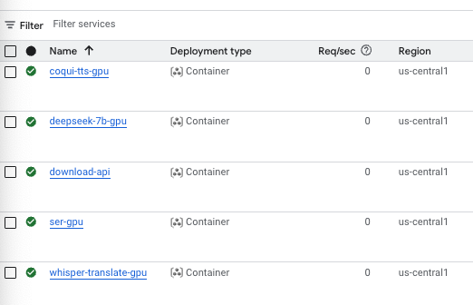
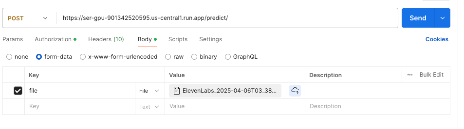

# SER-with-GPU
Speech Emotion Recognition on GPU (Google Cloud Run)

This repo shows how to take a Speech Emotion Recognition model from hugging face, and deploy it as an API with a GPU, on Google Cloud Run. 

Hugging Face Model: https://huggingface.co/CAiRE/SER-wav2vec2-large-xlsr-53-eng-zho-all-age

Paper for Model: https://arxiv.org/abs/2306.14517

Note: I did not train this model or contribute to the research in anyway. I am simply using this open sourced model, and showing how it can be deployed as an API, so developers can use it more easily when creating applications. 

Here is how the different emotions are categorized:

```python
negative = [
    'sadness',
    'fear',
    'angry',
    'disgust',
    'negative',
    "frustrated"
]

positive = [
    "happiness",
    "surprise",
    "positive",
    "excitement"
]

neutral = [
    "neutral",
    "other",
    "unknown"
]
```

The original model will predict the more granular emotions for example "disgust" or "happiness", and then I made the API simply sort the emotion into its sentiment category of positive negative or neutral. 

TODO: Make it so a flag can be sent to the API to allow for either granular or simplified predictions. 

#### Notes on Model Output Modifications
I did some changes to the output, which were simply to constrain the emotions into 3 more simple categories which include positive, negative and neutral. 


## Local Setup
1. Clone the project from GitHub, and open in your IDE. 
2. Open the terminal: (In VS Code) File -> New Terminal
3. Start a new virtual env using PyEnv: https://github.com/pyenv/pyenv
    ```bash
    pyenv local 3.10.0

    python -m venv venv

    source venv/bin/activate

    python -m pip install --upgrade pip

    pip install -r requirements.txt
    ```
4. To test the API locally, run:
    ```bash
    fastapi dev main.py  
    ```
5. Navigate to 
    ```bash
    http://127.0.0.1:8000/docs
    ```
6. Click on the "try it out" button
7. Then upload your local file and hit the "Execute button.

## How to Run with Docker Locally

1. Download docker desktop and start it. 
2. To clean up old containers ```docker system prune -a -f``` CAREFUL, only run this if you want to delete old local containers. 
3. ```docker build -t ser-gpu .```
4. ```docker run --name whisper-api-container -p 8080:8080 ser-gpu```
5. Navigate to http://127.0.0.1:8000/docs to test the API
5. To delete the container: ```docker rm -f /whisper-api-container```

### Notes on Local Testing

Local testing may or may not work depending on your own machines specs. For example, Pytorch requires different setup on MacOS, Linux or Windows. 

## Testing Live API with Postman

#### 1. Getting our API URL
- Navigate to https://console.cloud.google.com/
- Make sure you are logged in, and in the correct GCP project, which is show in a small box, in the top left corner. Select the correct project if needed. 
- Find the search bar in the GCP console at the very top and center of the page. 
- In the search bar type "cloud run" and select the icon for cloud run. 
- After selecting cloud run, it should show a list of your deployed APIs like so: 
    
- Select the API we want to test, in this case it is called ```ser-gpu```
- This will open the APIs details page. At the top center of the screen, bellow the search bar, it will show the API URL with a copy button, copy the URL. 


#### 2. Getting to Postman Workspace
- Navigate to https://postman.com
- Go to the ```Workspaces``` drop down menu in the top left. 
- In the drop down menu, select the ```My Workspace``` option if possible, or create a new workspace if you have none. 
- In the top left corner, select the ```New``` button and then  ```HTTP```. 

#### Entering our URL
- In the new workspace view, switch the drop down to ```POST``` next to the URL text box. 
- Paste the URL into the text box
- Add the ```/predict/``` endpoint to the URL string. It should look something like this:
    ```bash
    https://ser-gpu-905627347878.us-central1.run.app/predict/
    ```

#### 3. Making a Bearer Token
- Navigate back to the GCP console
- Select on the terminal icon in the top right corner, this should start the cloud terminal. 
- Authenticate in order to access the cloud terminal. 
- Inside the terminal, run this command 
    ```bash
    gcloud auth print-identity-token
    ```
- Copy the token

#### 4. Adding our Bearer Token in Postman
- Switch over back to Postman. 
- Underneath the URL text box, fild the ```Auth``` button and select it. 
- In the drop down menu, select ```Bearer Token```
- Paste the token from GCP into the text box. 

#### Adding our Data
- go to ```body``` and select ```form data``` from the drop down menu.
- Change to ```Key``` type from ```Text``` to ```File```
- Under the ```Key``` field, is a text box. In this text box, enter the word "file". 
- Under the ```Value``` field, select your file to upload a test audio file. It should look similar to this:
    
- Hit the send button and wait!

#### Notes on cold starts

The first time the API is called after not running for a while, it will take a long time to get a response, due to the server needing to restart. 

If this is an issue, here are a few ways this can be avoided. 
1. Create another simple endpoint to make a request to the URL before any any SER predictions need to be made. For example, you could call the API when someone logs in, or selects some option related to audio, to indicate that SER will be needed soon. 
2. Change the settings for the server deployment for the "min instances" to be >= 1. The documentation for how this works is here: https://cloud.google.com/run/docs/tips/general#use_minimum_instances_to_reduce_cold_starts 
3. You could create a scheduled script which pings the API to some kind of "Hello World" endpoint every 30 seconds or so, to keep the server warm. You could use Google Cloud Scheduler https://cloud.google.com/scheduler/docs or Github Actions to make this automation. 


## TODO
Note to self, next project should be a "keep warm" scheduler, where we can set parameters for which time of day to keep the API warm, and the intervals at which the API should be pinged to keep it alive. Then test the response times at any given time of day to verify that its fast. 


